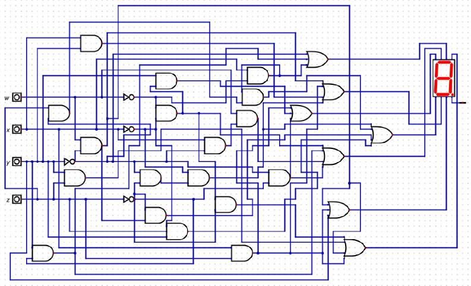
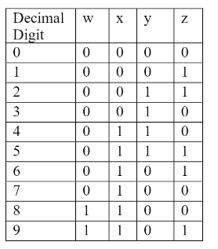
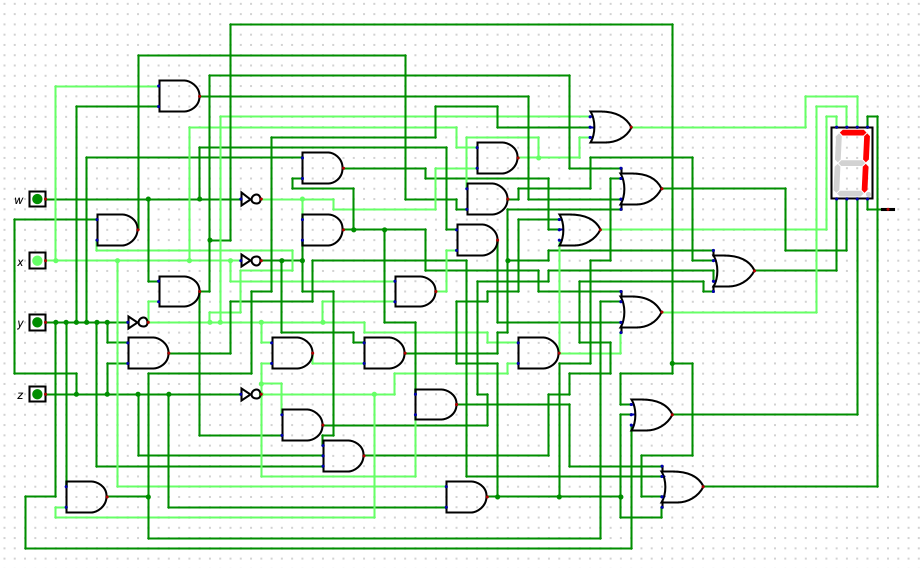

# Computer Architecture LED Circuit

This repository holds the work and circuit file for an LED circuit.  

## Table of Contents

- [The-Circuit](#the-circuit)
- [Installation](#installation)
- [Usage](#usage)
- [Example](#example)
- [Overview](#overview)

## The-Circuit    

## Installation

To view and test the circuit download the [digital logic simulator](https://github.com/hneemann/Digital). 

1. Download the project as a zip file
2. [Extract the zip file](https://www.wikihow.com/Unzip-a-File)
3. Open the simulator
4. Click file -> open, and then open the file
5. Click the play button to play with the circuit

## Usage

The following LED outputs correspond the to following 4 inputs:    

## Example

## Overview

[LED Circuit Work.pdf](https://github.com/LucasHasting/IP-Subnet-Calculator/blob/main/subnetting.py): contains the work for creating the circuit.   
[LED.dig](https://github.com/LucasHasting/IP-Subnet-Calculator/blob/main/functions_and_constants.py): the circuit file.
